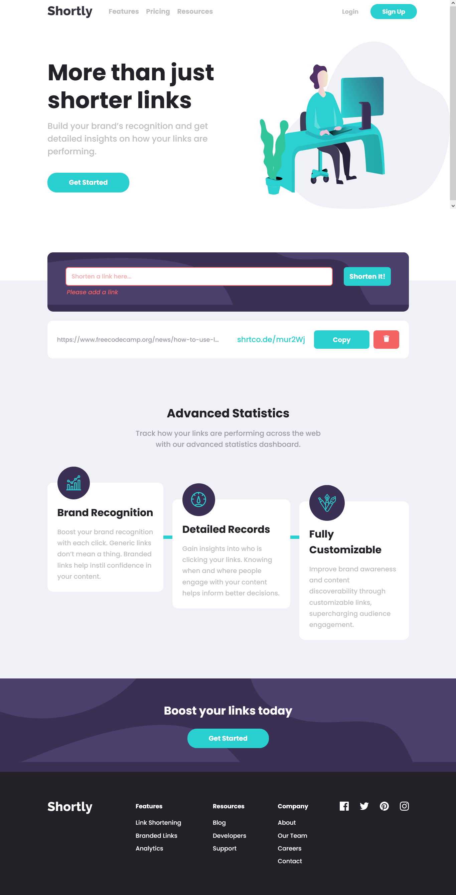

# Frontend Mentor - Shortly URL shortening API Challenge solution

This is a solution to the [Shortly URL shortening API Challenge challenge on Frontend Mentor](https://www.frontendmentor.io/challenges/url-shortening-api-landing-page-2ce3ob-G). Frontend Mentor challenges help you improve your coding skills by building realistic projects.

## Table of contents

- [Overview](#overview)
  - [The challenge](#the-challenge)
  - [Screenshot](#screenshot)
  - [Links](#links)
  - [Built with](#built-with)
  - [Continued development](#continued-development)
- [Author](#author)
- [Acknowledgments](#acknowledgments)

## Overview

### The challenge

Users should be able to:

- View the optimal layout for the site depending on their device's screen size
- Shorten any valid URL
- See a list of their shortened links, even after refreshing the browser
- Copy the shortened link to their clipboard in a single click
- Receive an error message when the `form` is submitted if:
  - The `input` field is empty

### Screenshot

### Links

- Solution URL: [Solution URL](https://your-solution-url.com)
- Live Site URL: [Live Site URL](https://shortlly-app.netlify.app/)

### Built with

- Semantic HTML5 markup
- CSS custom properties
- [SASS](https://sass-lang.com/) - CSS preprocessor
- Flexbox
- Mobile-first workflow
- [React](https://reactjs.org/) - JS library
- npm packages

### Continued development

I'd like to use local storage more in the nearest future as this is my first implementation of it.

## Author

- Website - [PORTFOLIO WEBSITE](https://oludare.netlify.app/)
- Frontend Mentor - [@Michaelhybrid](https://www.frontendmentor.io/profile/Michaelhybrid)
- Twitter - [@theHybridCoder](https://www.twitter.com/theHybridCoder)

## Acknowledgments

To God be the Glory!
